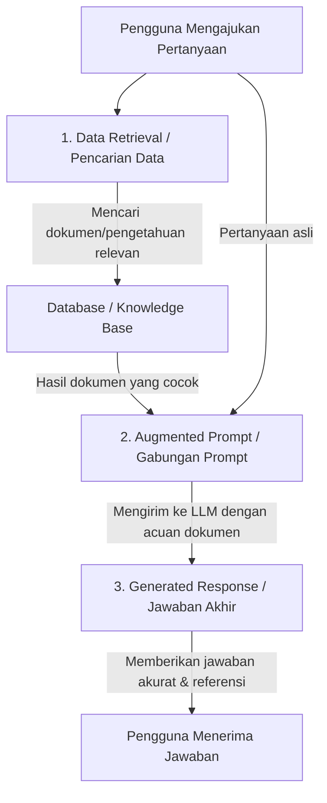
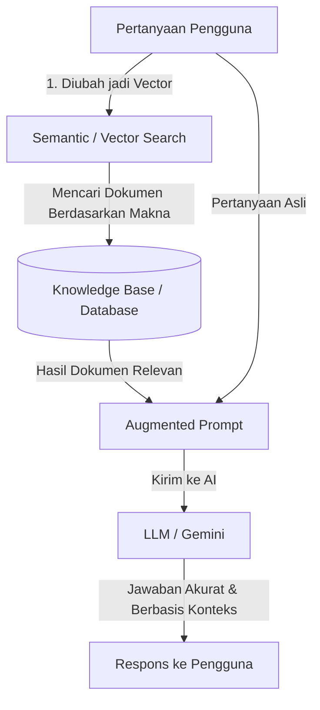

# Memahami-Apa-Itu-RAG-Retrieval-Augmented-Generation
Sederhana! Bayangkan Retrieval-Augmented Generation (RAG) seperti asisten pribadi yang sedang ujian dengan sistem open-book (buku terbuka).

**Retrieval-Augmented Generation (RAG)** adalah sebuah teknik untuk meningkatkan kualitas keluaran dari Model Bahasa Besar (LLM) dengan cara menghubungkannya (*grounding*) dengan sumber pengetahuan eksternal yang tidak tersedia saat model dilatih (*trained*).

Sederhananya, jika LLM biasa diibaratkan seperti seorang murid yang hanya mengandalkan hafalan saat ujian, **RAG** diibaratkan sebagai ujian dengan **sistem buka buku (*open-book*)**.

---

## 📊 Diagram Alur Kerja RAG

Berikut adalah diagram visual yang menunjukkan bagaimana sebuah aplikasi mendapatkan respons yang diperkaya menggunakan RAG:

# 3 Tahapan Utama dalam RAG

Berdasarkan arsitektur di atas, proses [Retrieval Augmented Generation (RAG)](https://www.skills.google/paths/1282/course_templates/1120/documents/636974) dibagi menjadi tiga tahapan berurutan:

## 1. Data Retrieval (Pencarian Data)
* **Konteks:** Model LLM standar tidak dilatih menggunakan data pribadi/dinamis pengguna atau dokumen khusus (seperti basis pengetahuan internal perusahaan). Data ini bersifat sensitif dan tidak mungkin dimasukkan ke dalam model publik.
* **Proses:** Aplikasi mengambil data atau dokumen yang paling relevan dari database atau knowledge base menggunakan ID pengguna, kata kunci, atau indeks pencarian berdasarkan pertanyaan yang diajukan.

## 2. Augmented Prompt (Penggabungan Prompt)
* **Proses:** Pertanyaan asli dari pengguna digabungkan (*augmented*) dengan data atau dokumen hasil pencarian pada tahap pertama.
* **Instruksi Khusus:** Pada tahap ini, *prompt* juga menginstruksikan model untuk mempercayai data yang disertakan serta meminta model untuk memberikan referensi atau tautan sumber dokumen agar pengguna dapat membaca dokumen aslinya secara utuh.

## 3. Generated Response (Pembuatan Jawaban)
* **Proses:** Model LLM membaca seluruh informasi yang ada di dalam *augmented prompt* (termasuk dokumen referensi) untuk menghasilkan jawaban akhir yang akurat, kontekstual, dan sesuai dengan data terbaru.

---

# Memahami Semantic Search, Vector Search, dan Hubungannya dengan RAG

Dalam membangun sistem [Retrieval-Augmented Generation (RAG)](https://www.skills.google/paths/1282/course_templates/1120/documents/636974), kualitas pencarian data (*retrieval*) sangat menentukan seberapa akurat jawaban yang diberikan oleh AI. Agar pencarian tidak sekadar mencocokkan kata perkata, RAG modern menggunakan **Semantic Search** dan **Vector Search**.

---

## 🔍 1. Apa itu Semantic Search?

Secara tradisional, aplikasi menggunakan **Keyword Search** (pencarian kata kunci) yang hanya mencari teks yang persis sama dengan apa yang diketik pengguna. 

Sebaliknya, **Semantic Search** berupaya memberikan hasil berdasarkan **makna atau konteks** dari pertanyaan, bukan sekadar kecocokan kata (*exact match*).
* **Contoh:** Jika pengguna mencari *"destinasi liburan populer di selatan ekuator"*, Semantic Search mengerti bahwa ini adalah filter geografis (belahan bumi selatan), sedangkan pencarian kata kunci biasa mungkin hanya mencari kata "selatan" atau "ekuator" secara acak tanpa memahami maksudnya.

---

## 📐 2. Apa itu Vector Search?

Untuk mewujudkan *semantic search*, teknologi yang digunakan di baliknya adalah **Vector Search**. 

* **Vector Search** menggunakan **vector** (deretan angka) untuk merepresentasikan isi konten dan mengukur kemiripannya di dalam ruang multi-dimensi.
* **Prosesnya terbagi menjadi 3 langkah:**
  1. **Encode the data:** Mengubah teks, gambar, atau audio menjadi *vector embeddings* menggunakan model AI (seperti model *embedding* dari Vertex AI).
  2. **Index the data:** Menyimpan dan mengelompokkan *embedding* tersebut ke dalam *database* khusus menggunakan indeks yang efisien (seperti teknologi [Vector Search](https://docs.cloud.google.com/gemini-enterprise-agent-platform/build/vector-search/overview) atau algoritma ScaNN) agar pencarian data skala besar bisa dilakukan dengan cepat.
  3. **Search the data:** Saat ada pertanyaan baru, pertanyaan tersebut juga diubah menjadi *vector*, lalu sistem mencari data terdekat (*nearest neighbors*) yang memiliki makna paling mirip.

---

## 🔗 3. Hubungan RAG, Semantic Search, dan Vector Search

Ketiga teknologi ini saling terikat erat dalam satu alur sistem yang utuh:

# High-Level Architecture dalam Sistem RAG (Retrieval-Augmented Generation)

Dalam membangun aplikasi kecerdasan buatan berbasis [RAG architecture using Agent Platform](https://www.skills.google/paths/1282/course_templates/1120/documents/636976), **High-level architecture (Arsitektur Tingkat Tinggi)** adalah cetak biru konseptual yang menggambarkan bagaimana komponen-komponen utama dan subsistem saling terhubung di Google Cloud untuk memproses data hingga menjawab permintaan pengguna.

---

## 🏗️ 4 Komponen Utama / Subsistem dalam Arsitektur

Berdasarkan desain tingkat tinggi pada sistem [RAG architecture using Agent Platform](https://www.skills.google/paths/1282/course_templates/1120/documents/636976), arsitektur ini dibagi menjadi beberapa bagian utama:

### 1. Data Ingestion Subsystem
* **Tujuan:** Menyiapkan dan memproses data eksternal (seperti file dokumen, data database, atau *streaming*) yang akan digunakan untuk mengaktifkan kapabilitas RAG serta *evaluation prompts*.
* **Interaksi:** Subsistem ini hanya berinteraksi dengan subsistem lainnya melalui lapisan *database*.

### 2. Serving Subsystem
* **Tujuan:** Menangani alur permintaan dan jawaban (*request-response*) secara *real-time* antara aplikasi AI (seperti *chatbot* atau aplikasi seluler) dengan penggunanya.
* **Interaksi:** Mengambil data yang sudah diproses dan diubah menjadi *embeddings* melalui lapisan *database* untuk melakukan *semantic search*.

### 3. Quality Evaluation Subsystem (Opsional)
* **Tujuan:** Menyediakan metode otomatis untuk mengevaluasi kualitas respons yang dihasilkan oleh *serving subsystem* (misalnya menguji akurasi faktual dan relevansi).
* **Interaksi:** Berinteraksi langsung dengan *serving subsystem* dan terhubung ke *data ingestion subsystem* melalui *database*.

### 4. Databases
* **Tujuan:** Menyimpan berbagai data penting sistem, yang meliputi:
  * *Prompts*
  * *Vectorized embeddings* dari data RAG
  * Konfigurasi untuk *serverless jobs* pada subsistem *data ingestion* dan *quality evaluation*.
* **Interaksi:** Menjadi pusat penghubung di mana **seluruh subsistem** dalam arsitektur berinteraksi dengannya.

---

## 💡 Mengapa High-Level Architecture Ini Penting?

1. **Memberikan Kejelasan Alur Kerja (*End-to-End*):** Membantu pengembang memahami perjalanan data secara utuh—mulai dari dokumen diunggah, diproses menjadi *vector*, disimpan di *database*, dicari secara *semantic*, hingga akhirnya dirangkum oleh LLM menjadi jawaban akurat bagi pengguna.
2. **Skalabilitas dan Modularitas:** Dengan memisahkan fungsi ke dalam subsistem yang spesifik (seperti pemisahan antara pengolahan data mentah dan penanganan *traffic* pengguna), sistem dapat dikembangkan, diskalakan, atau diperbarui secara independen tanpa merusak sistem secara keseluruhan.
3. **Standar Desain *Enterprise*:** Memastikan aplikasi AI dibangun di atas fondasi cloud yang terstruktur, aman, serta mendukung pemantauan kinerja dan evaluasi kualitas data secara berkelanjutan.
