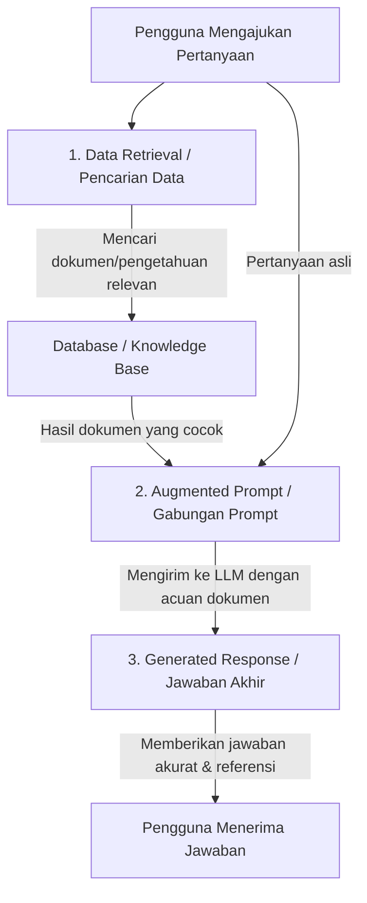

# Memahami-Apa-Itu-RAG-Retrieval-Augmented-Generation
Sederhana! Bayangkan Retrieval-Augmented Generation (RAG) seperti asisten pribadi yang sedang ujian dengan sistem open-book (buku terbuka).

**Retrieval-Augmented Generation (RAG)** adalah sebuah teknik untuk meningkatkan kualitas keluaran dari Model Bahasa Besar (LLM) dengan cara menghubungkannya (*grounding*) dengan sumber pengetahuan eksternal yang tidak tersedia saat model dilatih (*trained*).

Sederhananya, jika LLM biasa diibaratkan seperti seorang murid yang hanya mengandalkan hafalan saat ujian, **RAG** diibaratkan sebagai ujian dengan **sistem buka buku (*open-book*)**.

---

## 📊 Diagram Alur Kerja RAG

Berikut adalah diagram visual yang menunjukkan bagaimana sebuah aplikasi mendapatkan respons yang diperkaya menggunakan RAG:

# 3 Tahapan Utama dalam RAG

Berdasarkan arsitektur di atas, proses [Retrieval Augmented Generation (RAG)](https://www.skills.google/paths/1282/course_templates/1120/documents/636974) dibagi menjadi tiga tahapan berurutan:

## 1. Data Retrieval (Pencarian Data)
* **Konteks:** Model LLM standar tidak dilatih menggunakan data pribadi/dinamis pengguna atau dokumen khusus (seperti basis pengetahuan internal perusahaan). Data ini bersifat sensitif dan tidak mungkin dimasukkan ke dalam model publik.
* **Proses:** Aplikasi mengambil data atau dokumen yang paling relevan dari database atau knowledge base menggunakan ID pengguna, kata kunci, atau indeks pencarian berdasarkan pertanyaan yang diajukan.

## 2. Augmented Prompt (Penggabungan Prompt)
* **Proses:** Pertanyaan asli dari pengguna digabungkan (*augmented*) dengan data atau dokumen hasil pencarian pada tahap pertama.
* **Instruksi Khusus:** Pada tahap ini, *prompt* juga menginstruksikan model untuk mempercayai data yang disertakan serta meminta model untuk memberikan referensi atau tautan sumber dokumen agar pengguna dapat membaca dokumen aslinya secara utuh.

## 3. Generated Response (Pembuatan Jawaban)
* **Proses:** Model LLM membaca seluruh informasi yang ada di dalam *augmented prompt* (termasuk dokumen referensi) untuk menghasilkan jawaban akhir yang akurat, kontekstual, dan sesuai dengan data terbaru.
