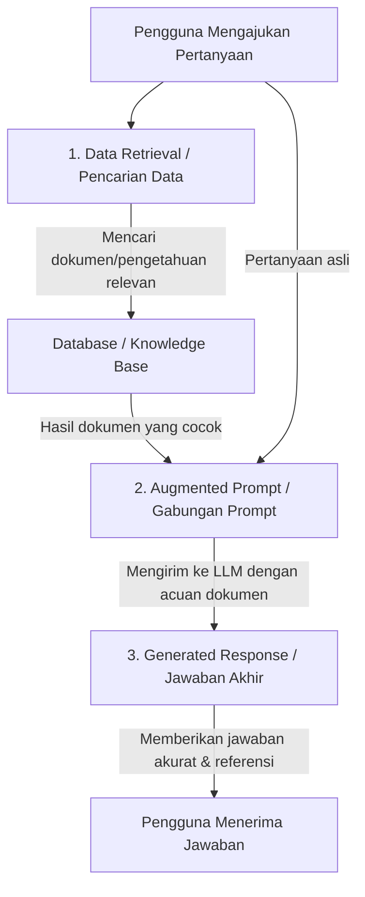

# Memahami-Apa-Itu-RAG-Retrieval-Augmented-Generation
Sederhana! Bayangkan Retrieval-Augmented Generation (RAG) seperti asisten pribadi yang sedang ujian dengan sistem open-book (buku terbuka).

**Retrieval-Augmented Generation (RAG)** adalah sebuah teknik untuk meningkatkan kualitas keluaran dari Model Bahasa Besar (LLM) dengan cara menghubungkannya (*grounding*) dengan sumber pengetahuan eksternal yang tidak tersedia saat model dilatih (*trained*).

Sederhananya, jika LLM biasa diibaratkan seperti seorang murid yang hanya mengandalkan hafalan saat ujian, **RAG** diibaratkan sebagai ujian dengan **sistem buka buku (*open-book*)**.

---

## 📊 Diagram Alur Kerja RAG

Berikut adalah diagram visual yang menunjukkan bagaimana sebuah aplikasi mendapatkan respons yang diperkaya menggunakan RAG:

 test
